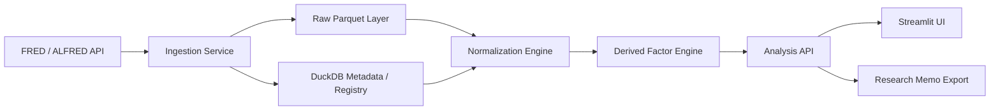

# FRED API を用いた FX マーケット分析基盤 実装仕様書 v1.0

## 1. 文書目的

本書は、前段で定義した **FRED/ALFRED を使った FX マーケット分析データ仕様書** を、実際に開発可能なレベルまで落とし込んだ **実装仕様書** である。対象は USD / JPY / EUR / AUD を中心とした日次〜月次のマクロ・金利・レジーム分析であり、Research / Regime Desk が以下を行えることを目的とする。

- 通貨ペアの適性評価
- 金利差・レジーム分析
- vintage-safe なマクロ研究
- release/event 周辺の観察
- 人間が UI 上で仮説を確認し、研究メモを作成すること

本基盤は **執行系ではない**。ティック執行、注文管理、スリッページ推定、秒足イベントトレードは対象外とする。

---

## 2. 実装方針

### 2.1 採用アーキテクチャ

- **Backend API**: FastAPI
- **UI**: Streamlit
- **分析ストレージ**: DuckDB + Parquet
- **データ処理**: Polars
- **データ検証**: Pandera
- **チャート**: Plotly
- **ジョブ制御**: 初期版は FastAPI + cron、将来はワーカー/Prefect 拡張可能

### 2.2 この構成を採用する理由

- FRED API は REST/JSON ベースなので FastAPI との親和性が高い。
- DuckDB は Parquet を直接読め、列・フィルタ pushdown を自動で行うため、ローカル分析基盤に向く。
- Streamlit は multipage app を簡単に構成でき、人間向けの研究 UI を短期間で作りやすい。
- Plotly を使うとレジーム帯やイベント帯を重ねた対話型チャートを作りやすい。
- Polars lazy API は中間処理を遅延評価でき、特徴量パイプラインに向く。

---

## 3. システム全体像



### 3.1 論理コンポーネント

1. **Ingestion Service**
   - FRED/ALFRED から series metadata / observations / release calendar / vintages を取得
   - raw 保存

2. **Normalization Engine**
   - series ごとの向き・頻度・欠測・通貨方向を正規化

3. **Factor Engine**
   - 金利差、カーブ差、USD broad index 変化率、商品 proxy などを生成

4. **Analysis API**
   - ペア分析、パネル生成、レジーム分析、イベント窓抽出

5. **Human UI**
   - 人間が series を探索、比較、保存、メモ化できる画面

---

## 4. リポジトリ構成

```text
fred-fx-research/
  app/
    api/
      main.py
      routers/
        health.py
        series.py
        observations.py
        panels.py
        factors.py
        regimes.py
        releases.py
        memo.py
    core/
      config.py
      logging.py
      auth.py
      exceptions.py
    services/
      fred_client.py
      alfred_client.py
      registry_service.py
      ingest_service.py
      normalize_service.py
      panel_service.py
      factor_service.py
      regime_service.py
      memo_service.py
      freshness_service.py
    models/
      api_models.py
      domain_models.py
      pandera_models.py
    storage/
      duckdb.py
      parquet_io.py
      repositories/
        registry_repo.py
        observation_repo.py
        release_repo.py
        panel_repo.py
        audit_repo.py
  ui/
    Home.py
    pages/
      01_Series_Catalog.py
      02_Pair_Workspace.py
      03_Regime_Dashboard.py
      04_Event_Study.py
      05_Data_Quality.py
      06_Memo_Builder.py
  sql/
    schema.sql
    views.sql
  jobs/
    backfill_series.py
    daily_refresh.py
    refresh_release_calendar.py
  tests/
    unit/
    integration/
    e2e/
  data/
    raw/
    normalized/
    derived/
    cache/
  docs/
    api_examples/
    ui_wireframes/
  .env.example
  pyproject.toml
  Makefile
  README.md
```

---

## 5. 実装対象スコープ

### 5.1 v1 必須

- series 検索
- series metadata 取得
- observations 取得
- vintages 取得
- release calendar 取得
- FX クオート正規化
- panel 構築
- 金利差/カーブ差算出
- ペア別 dashboard UI
- データ鮮度監査
- 研究メモ出力

### 5.2 v1.1 以降

- release bulk ingestion (v2)
- vintage replay UI
- rule-based regime tagging
- HMM / state-space analysis
- PDF memo export
- notebook template 自動生成

---

## 6. データモデル実装仕様

## 6.1 DuckDB テーブル一覧

### 6.1.1 `dim_series_registry`
series の正規化済みメタデータ

```sql
CREATE TABLE IF NOT EXISTS dim_series_registry (
    series_id TEXT PRIMARY KEY,
    title TEXT NOT NULL,
    source_name TEXT,
    release_id INTEGER,
    release_name TEXT,
    units_native TEXT,
    frequency_native TEXT,
    seasonal_adjustment TEXT,
    observation_start DATE,
    observation_end DATE,
    last_updated TIMESTAMP,
    notes TEXT,
    domain TEXT,
    base_ccy TEXT,
    quote_ccy TEXT,
    pair TEXT,
    quote_direction TEXT,
    freshness_status TEXT,
    created_at TIMESTAMP DEFAULT CURRENT_TIMESTAMP,
    updated_at TIMESTAMP DEFAULT CURRENT_TIMESTAMP
);
```

### 6.1.2 `fact_series_observations_raw`
FRED 生観測値

```sql
CREATE TABLE IF NOT EXISTS fact_series_observations_raw (
    series_id TEXT NOT NULL,
    date DATE NOT NULL,
    value_raw TEXT NOT NULL,
    value_num DOUBLE,
    realtime_start DATE NOT NULL,
    realtime_end DATE NOT NULL,
    retrieved_at_utc TIMESTAMP NOT NULL,
    file_batch_id TEXT NOT NULL,
    PRIMARY KEY (series_id, date, realtime_start, realtime_end)
);
```

### 6.1.3 `fact_series_vintages`
series 改定日履歴

```sql
CREATE TABLE IF NOT EXISTS fact_series_vintages (
    series_id TEXT NOT NULL,
    vintage_date DATE NOT NULL,
    retrieved_at_utc TIMESTAMP NOT NULL,
    PRIMARY KEY (series_id, vintage_date)
);
```

### 6.1.4 `fact_release_calendar`
リリース日

```sql
CREATE TABLE IF NOT EXISTS fact_release_calendar (
    release_id INTEGER NOT NULL,
    release_name TEXT NOT NULL,
    release_date DATE NOT NULL,
    press_release BOOLEAN,
    link TEXT,
    retrieved_at_utc TIMESTAMP NOT NULL,
    PRIMARY KEY (release_id, release_date)
);
```

### 6.1.5 `fact_market_series_normalized`
正規化済み時系列

```sql
CREATE TABLE IF NOT EXISTS fact_market_series_normalized (
    series_id TEXT NOT NULL,
    obs_date DATE NOT NULL,
    domain TEXT NOT NULL,
    pair TEXT,
    base_ccy TEXT,
    quote_ccy TEXT,
    value DOUBLE,
    units_normalized TEXT,
    is_derived BOOLEAN DEFAULT FALSE,
    transformation TEXT,
    source_frequency TEXT,
    frequency_requested TEXT,
    aggregation_method TEXT,
    as_of_realtime_start DATE,
    as_of_realtime_end DATE,
    created_at TIMESTAMP DEFAULT CURRENT_TIMESTAMP,
    PRIMARY KEY (series_id, obs_date, as_of_realtime_start, as_of_realtime_end)
);
```

### 6.1.6 `fact_derived_factors`
特徴量

```sql
CREATE TABLE IF NOT EXISTS fact_derived_factors (
    factor_id TEXT NOT NULL,
    obs_date DATE NOT NULL,
    pair TEXT,
    factor_group TEXT NOT NULL,
    factor_name TEXT NOT NULL,
    value DOUBLE,
    input_series_ids TEXT,
    formula TEXT,
    created_at TIMESTAMP DEFAULT CURRENT_TIMESTAMP,
    PRIMARY KEY (factor_id, obs_date, pair)
);
```

### 6.1.7 `audit_ingestion_runs`
取り込み監査

```sql
CREATE TABLE IF NOT EXISTS audit_ingestion_runs (
    run_id TEXT PRIMARY KEY,
    job_name TEXT NOT NULL,
    started_at TIMESTAMP NOT NULL,
    finished_at TIMESTAMP,
    status TEXT NOT NULL,
    endpoint TEXT,
    request_params TEXT,
    record_count INTEGER,
    error_message TEXT
);
```

---

## 6.2 Parquet レイヤ

### raw layer
- `data/raw/series_id=DEXJPUS/year=2026/*.parquet`
- 生 JSON を正規化した縦持ち形式で保存

### normalized layer
- `data/normalized/domain=fx_spot/pair=USDJPY/*.parquet`
- 分析で直接読むレイヤ

### derived layer
- `data/derived/factor_group=rate_spreads/pair=USDJPY/*.parquet`

### partition 規則
- 日次系列: `series_id`, `year`
- パネル: `pair`, `frequency`, `year`
- イベント研究: `release_id`, `window_size`

---

## 7. シリーズ正規化ルール

## 7.1 FX quote normalizer

### 変換マッピング

| FRED series_id | FRED表現 | canonical pair | 解釈 |
|---|---|---|---|
| DEXJPUS | JPY per USD | USDJPY | そのまま採用 |
| DEXUSEU | USD per EUR | EURUSD | そのまま採用 |
| DEXUSAL | USD per AUD | AUDUSD | そのまま採用 |

### 共通ルール
- 内部表現は必ず `price_quote_per_base`
- raw 値は一切上書きしない
- value_raw = "." は `NULL` に変換し、`missing_flag=true` を内部で扱う
- derived cross は raw とは別管理とする

### derived cross 例
- `EURJPY = EURUSD * USDJPY`
- `AUDJPY = AUDUSD * USDJPY`
- `EURAUD = EURUSD / AUDUSD`

---

## 8. API 実装仕様

## 8.1 API 共通仕様

- base path: `/api/v1`
- response format: JSON
- request/response model: Pydantic
- OpenAPI 自動生成を有効化
- long job は `202 Accepted` + `job_id` を返す
- 監査ログを全 endpoint に付与

### 共通レスポンス envelope

```json
{
  "status": "ok",
  "as_of": "2026-03-14T09:00:00Z",
  "timezone": "UTC",
  "data": {},
  "warnings": [],
  "errors": []
}
```

## 8.2 Endpoint 一覧

### 8.2.1 `GET /health`
用途: ヘルスチェック

**response**
```json
{
  "status": "ok",
  "services": {
    "duckdb": "ok",
    "parquet": "ok",
    "fred": "degraded"
  }
}
```

### 8.2.2 `GET /series/search`
用途: FRED series search の proxy + registry 検索

**query params**
- `q: str`
- `tag_names: str | null`
- `exclude_tag_names: str | null`
- `limit: int = 50`
- `refresh_from_fred: bool = false`

### 8.2.3 `GET /series/{series_id}`
用途: registry metadata 取得

### 8.2.4 `POST /observations/fetch`
用途: observations を FRED/ALFRED から取得して保存

**request**
```json
{
  "series_id": "DEXJPUS",
  "observation_start": "2010-01-01",
  "observation_end": "2026-03-01",
  "units": "lin",
  "frequency": "d",
  "aggregation_method": "eop",
  "realtime_start": "2026-03-14",
  "realtime_end": "2026-03-14",
  "vintage_dates": null,
  "store_raw": true,
  "normalize": true
}
```

### 8.2.5 `POST /vintages/fetch`
用途: vintagedates 取得・保存

### 8.2.6 `POST /releases/fetch`
用途: release calendar を取得

### 8.2.7 `POST /panel/build`
用途: 指定 pair 用 macro panel 生成

**request**
```json
{
  "pair": "USDJPY",
  "date_start": "2012-01-01",
  "date_end": "2026-03-01",
  "frequency": "D",
  "vintage_mode": false,
  "features": [
    "spot",
    "us_3m",
    "jp_3m",
    "us_10y",
    "jp_10y",
    "vix",
    "usd_broad"
  ]
}
```

### 8.2.8 `POST /factors/compute`
用途: 金利差・curve・変化率特徴量生成

### 8.2.9 `POST /regimes/tag`
用途: rule-based regime labeling

**出力例**
```json
{
  "pair": "AUDUSD",
  "regime_rows": [
    {
      "obs_date": "2025-12-01",
      "risk_state": "risk_on",
      "carry_state": "aud_favored",
      "usd_state": "usd_strong",
      "event_pressure": "low"
    }
  ]
}
```

### 8.2.10 `POST /analysis/pair-suitability`
用途: ペア適性分析の構造化出力

### 8.2.11 `POST /memo/generate`
用途: 研究メモ草案の JSON / Markdown 生成

---

## 9. サービスクラス仕様

## 9.1 `FredClient`
責務: FRED v1 client

### public methods
- `search_series(...)`
- `get_series_metadata(series_id)`
- `get_observations(series_id, ...)`
- `get_vintagedates(series_id, ...)`
- `get_release_dates(...)`

### 実装要件
- httpx async client を使用
- retry: exponential backoff
- 429 / 500 / 502 / 503 / 504 を retry 対象
- user agent を付与
- `file_type=json` を固定

## 9.2 `FredV2Client`
責務: bulk release ingest

### public methods
- `get_release_observations(release_id, next_cursor=None)`

### 実装要件
- API key を HTTP header で送れる形にする
- `next_cursor` を使ったページング対応
- v2 用 rate throttle を強制

## 9.3 `RegistryService`
責務: series registry 管理

### 処理
- 初回探索結果を registry に upsert
- title / notes / release / units / last_updated を保持
- quote_direction と domain を付与
- freshness 判定を行う

## 9.4 `NormalizeService`
責務: 生時系列を内部 canonical schema へ変換

### 処理
- value_raw → numeric 変換
- 欠測の明示化
- quote mapping
- requested frequency metadata の付与
- raw / normalized 分離保存

## 9.5 `PanelService`
責務: pair 用パネル作成

### 処理順
1. pair に必要な series set を解決
2. 指定日付範囲で normalized series を取得
3. 日付軸を生成
4. as-of join
5. 欠測率計算
6. パネル保存

## 9.6 `FactorService`
責務: 特徴量生成

### 実装する計算
- `rate_spread = ccy1_short_rate - ccy2_short_rate`
- `yield_spread = ccy1_10y - ccy2_10y`
- `curve_slope = 10y - 3m`
- `spot_return_1d / 5d / 20d`
- `broad_usd_change_5d / 20d`
- `vix_change_1d / 5d`
- `realized_vol_20d`

## 9.7 `RegimeService`
責務: rule-based regime tagging

### 初期ルール例
- `risk_off`: VIX > rolling_252d_p75
- `usd_strong`: DTWEXBGS zscore > 1.0
- `carry_positive_for_usdjpy`: us_jp_3m_spread > 0
- `curve_inversion_us`: us_curve < 0
- `event_pressure_high`: major release ±1 business day

---

## 10. Vintage-safe 実装仕様

### 10.1 モード

#### current mode
- `realtime_start = today`
- `realtime_end = today`
- 現時点で見える過去データを使う

#### vintage mode
- `realtime_start = t`
- `realtime_end = t`
- その時点で見えていたデータのみを使う

### 10.2 ルール
- backtest 研究に使うパネルは `vintage_mode` を request で明示する
- vintage mode で欠測になる系列は forward fill しない
- event study は release date と availability を別概念にする
- memo には必ず `vintage_mode` を明記する

---

## 11. データ鮮度監査仕様

## 11.1 `FreshnessService`

### 入力
- metadata.last_updated
- observation_end
- frequency_native
- notes

### 出力
- `ok`
- `warning`
- `reject`

### 判定ルール例
- 日次 series で最終観測が 10 営業日以上古い → `warning`
- 月次 series で最終観測が 120 日以上古い → `warning`
- 四半期 series を日次 panel の主要因子として要求 → `warning`
- 更新停止 / discontinued 明記 → `reject` または `auxiliary_only`

---

## 12. UI 実装仕様

UI は **人間が研究できること** を重視する。操作対象は「series」「pair」「event window」「memo」である。

### 12.1 UI 技術選定
- Streamlit multipage app
- `st.navigation` 方式でページ制御
- `st.session_state` で pair / date range / selected series / memo draft を保持
- `st.cache_data` で重い panel query を cache
- `st.cache_resource` で DuckDB connection / API clients を保持

### 12.2 画面一覧

#### A. Home
目的: システム状態と主要ペア概況

**表示要素**
- 最終更新時刻
- データ鮮度警告
- 主要ペアカード: USDJPY / EURUSD / AUDUSD
- 今日の注目 release
- 最近保存したメモ

#### B. Series Catalog
目的: series 検索と採用判定

**入力**
- キーワード
- tag filter
- frequency filter
- freshness filter

**出力**
- series table
- metadata panel
- notes / source / observation period
- 「watchlist に追加」ボタン

#### C. Pair Workspace
目的: 個別 pair の中核分析

**入力**
- pair
- date range
- frequency
- current / vintage mode

**出力**
- spot chart
- short rate spread chart
- 10Y spread chart
- broad USD / VIX overlay
- rolling correlation table
- missing data summary

#### D. Regime Dashboard
目的: regime 切替を視覚化

**出力**
- risk on/off タグ時系列
- carry favorable/unfavorable 区間
- curve inversion marker
- regime 別平均リターン表
- regime transition summary

#### E. Event Study
目的: release 周辺の観測

**入力**
- release type
- event window [-5, +5]
- pair

**出力**
- event-aligned cumulative return chart
- pre/post mean move
- hit ratio
- raw event table

#### F. Data Quality
目的: 欠測・鮮度・異常検知

**出力**
- stale series list
- missing heatmap
- frequency mismatch report
- quote direction audit
- ingestion log table

#### G. Memo Builder
目的: 研究メモ作成

**入力**
- research question
- selected pair
- selected date range
- selected factors

**出力**
- hypothesis
- observations
- uncertainty
- next experiment
- risk controls
- markdown export

### 12.3 UI ワイヤーフロー

#### Pair Workspace フロー
1. ユーザーが pair と期間を選ぶ
2. UI は `/panel/build` を呼ぶ
3. 結果を cache する
4. 各 subplot 相当の interactive chart を表示
5. 「regime overlay」「event overlay」「memo へ送る」を操作できる

#### Memo Builder フロー
1. Pair Workspace から現在の分析状態を引き継ぐ
2. 所見を編集
3. 「仮説」「観測」「不足証拠」を分けて入力
4. Markdown 保存
5. API に memo artifact として保存

---

## 13. UI コンポーネント詳細

### 13.1 共通サイドバー
- pair selector
- date range
- frequency selector
- vintage mode toggle
- refresh button
- save current view button

### 13.2 Plotly チャート規約
- x 軸は UTC date
- event 帯は半透明 rectangle
- regime 帯は色分け
- hover に source series と値を表示
- derived factor は formula tooltip を表示

### 13.3 テーブル規約
- すべて download csv を許可
- stale / warning 行は色付け
- click 行で metadata 詳細を表示

---

## 14. セキュリティ仕様

- FRED API key は `.env` 経由で注入
- UI に key を露出しない
- `/docs` は内部利用前提。外部公開時は basic auth または reverse proxy 制御
- request logging では API key をマスク
- memo / saved view に個人情報を書かない

### 環境変数

```env
APP_ENV=dev
APP_HOST=0.0.0.0
APP_PORT=8000
FRED_API_KEY=xxxxxxxxxxxxxxxx
DUCKDB_PATH=./data/fred_fx.duckdb
RAW_DATA_ROOT=./data/raw
NORMALIZED_DATA_ROOT=./data/normalized
DERIVED_DATA_ROOT=./data/derived
DEFAULT_TZ=UTC
STREAMLIT_SERVER_PORT=8501
```

---

## 15. 運用仕様

## 15.1 バッチ

### daily_refresh.py
- 対象: 日次 FX, broad USD, VIX
- 実行: 毎営業日 1 回
- 処理:
  1. series refresh
  2. normalize
  3. factor recompute
  4. freshness audit

### weekly_refresh.py
- 対象: vintages, release calendar, rate proxies

### monthly_refresh.py
- 対象: CPI/活動系 override 候補 series の監査

## 15.2 障害時挙動
- FRED 取得失敗 → run status = failed
- 既存 raw を壊さない
- UI では "latest refresh failed" を明示
- stale だが既存データが読める場合は degraded mode

---

## 16. テスト仕様

## 16.1 unit tests
- quote normalizer
- factor formulas
- freshness rules
- response schema validation

## 16.2 integration tests
- FRED mock response → raw 저장 → normalize → panel build
- vintage mode join correctness
- release calendar fetch

## 16.3 e2e tests
- UI から USDJPY パネルを開ける
- event study を描画できる
- memo export が動く

## 16.4 golden dataset tests
- 固定サンプル series で factor 値が既知値と一致
- `DEXJPUS`, `DEXUSEU`, `DEXUSAL`, `DTWEXBGS` を最低限の golden set とする

---

## 17. 受け入れ基準

### 17.1 API
- 指定 series を observations として取得できる
- raw / normalized が分離保存される
- pair panel が 3 秒以内に返る（ローカル標準データ量）
- stale series が warning になる
- vintage mode と current mode で値差分を確認できる

### 17.2 UI
- ユーザーが 3 クリック以内で USDJPY / EURUSD / AUDUSD の分析画面に到達できる
- event window の比較が UI で完結する
- メモを Markdown で保存できる
- 欠測や stale を視覚的に把握できる

### 17.3 研究品質
- メモに `as_of`, `sources`, `vintage_mode`, `missing_evidence` が自動付与される
- 仮説と観測を別セクションに出力できる

---

## 18. 開発フェーズ

## Phase 1: 基盤
- FastAPI skeleton
- DuckDB schema
- FredClient
- observations fetch
- Series Catalog UI

## Phase 2: 正規化とパネル
- NormalizeService
- PanelService
- Pair Workspace UI
- Plotly chart

## Phase 3: factor / regime
- FactorService
- RegimeService
- Regime Dashboard UI

## Phase 4: event / memo
- release calendar
- Event Study UI
- Memo Builder

## Phase 5: hardening
- freshness audit
- tests
- deployment scripts

---

## 19. 最小実装の優先順位

最初に作るべきものは次の順序とする。

1. `FredClient.get_observations`
2. `dim_series_registry` / `fact_series_observations_raw`
3. `NormalizeService`
4. `PanelService`
5. `Pair Workspace UI`
6. `FactorService`
7. `FreshnessService`
8. `Memo Builder`

この順で作れば、まず **人間が見て分析できる最小プロダクト** が成立する。

---

## 20. 将来拡張

- OANDA / broker data と接続して FRED 以外の高頻度データと重ねる
- ノートブック自動生成
- research memo のテンプレ管理
- LLM による explanation assist
- Git ベースの experiment brief export
- Slack / Discord 通知

---

## 21. 実装判断メモ

- 初期版 UI は Streamlit が最適。理由は、研究用途で「速度」と「対話性」が最優先であり、厳密なフロント分離より開発速度の価値が高いため。
- 保存層は DuckDB + Parquet に固定する。理由は、研究データの join と列指向集計が軽く、運用コストが低いため。
- 長時間ジョブを FastAPI の request lifecycle に閉じ込めない。短い更新は BackgroundTasks、長い再取り込みは cron or worker に切り出す。
- vintage-safe join は v1 から必須に近い。実証研究で将来改定値が混ざると説明の信用が落ちるため。

---

## 22. 参考 API / 実装メモ

### FRED request 例
```bash
curl "https://api.stlouisfed.org/fred/series/observations?series_id=DEXJPUS&api_key=$FRED_API_KEY&file_type=json"
```

### FRED v2 release observations 例
```bash
curl -H "api_key: $FRED_API_KEY" \
  "https://api.stlouisfed.org/fred/v2/release/observations?release_id=52&format=json"
```

### DuckDB query 例
```sql
SELECT obs_date, value
FROM read_parquet('data/normalized/domain=fx_spot/pair=USDJPY/*.parquet')
WHERE obs_date >= DATE '2024-01-01';
```

---

## 23. 結論

本実装仕様の中核は、

- **FRED/ALFRED 取得**
- **quote 向きの正規化**
- **DuckDB/Parquet による分析保存**
- **FastAPI による分析 API**
- **Streamlit による人間向け研究 UI**

の 5 層である。

これにより、単なるデータ取得ツールではなく、**人間が FX のレジームを見て、理由を考え、仮説を保存できる research workbench** が成立する。
