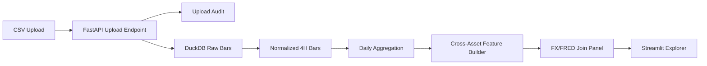

# USATECHIDXUSD240.csv 取り込み拡張 実装仕様書 v1.1

## 1. 文書目的

本書は、既存の **FRED API を用いた FX マーケット分析基盤 実装仕様書 v1.0** に対して、アップロード済みの **`USATECHIDXUSD240.csv`** を取り込み、FRED マクロ系列と結合できるようにするための **DuckDB テーブル定義** と **FastAPI / Streamlit 追加仕様** を定義する。

この CSV は FX ペアそのものではなく、**クロスアセットの高頻度リスク選好 proxy** として扱う。主用途は以下。

- USDJPY / EURUSD / AUDUSD へのクロスアセット説明変数追加
- risk-on / risk-off の高頻度レジーム判定
- no-trade 条件候補の設計
- FRED の日次マクロ系列に対する短期センチメント補完

---

## 2. 対象データの前提

### 2.1 ファイル前提

対象ファイル: `USATECHIDXUSD240.csv`

想定フォーマット:
- 区切り: タブ (`\t`)
- ヘッダ: なし
- 1 行 6 列
- 列順: `timestamp, open, high, low, close, volume`
- 時刻基準: UTC
- 足種別: 4 時間足 (`240`)

### 2.2 正規化後の instrument 定義

- `instrument_id`: `usatechidxusd_h4`
- `vendor_symbol`: `USATECHIDXUSD`
- `canonical_symbol`: `USATECHIDXUSD`
- `asset_class`: `equity_index`
- `quote_ccy`: `USD`
- `base_ccy`: `USATECHIDX`
- `timeframe_native`: `240`
- `timezone_native`: `UTC`
- `source_system`: `local_csv`
- `source_vendor`: `manual_upload`

### 2.3 このデータの役割

このデータは **トレード対象テーブル** ではなく、まずは **クロスアセット説明変数テーブル** として使う。

最初に作る特徴量は以下。

- 4h リターン
- 1d リターン
- 5d / 20d モメンタム
- 5d / 20d 実現ボラ proxy
- 20d ドローダウン
- 1d 高低レンジ率
- セッション別リターン
- 週末明けギャップ

---

## 3. 追加アーキテクチャ



### 3.1 重要方針

1. **全書き込みは FastAPI 経由**
   - Streamlit が別プロセスで起動している場合、UI から DuckDB へ直接書き込まない。
   - Streamlit は upload / build / refresh をすべて API 経由で呼ぶ。

2. **DuckDB は raw / normalized / mart を分離**
   - raw は append-only
   - normalized は upsert / rebuild 可
   - mart は再生成可能

3. **CSV parser は auto-detect に依存しすぎない**
   - 本ファイルは形式が既知なので `delimiter`, `header`, `timestamp format`, `column types` を明示する。

4. **FRED 結合は日次に揃えてから行う**
   - 4h バーを直接 FRED の日次系列に join しない。
   - まず 1d 集約してから daily panel を作る。

---

## 4. リポジトリ追加構成

```text
fred-fx-research/
  app/
    api/
      routers/
        market_uploads.py
        market_bars.py
        cross_asset.py
    services/
      csv_ingest_service.py
      market_bar_service.py
      cross_asset_feature_service.py
      join_panel_service.py
      validation_service.py
    storage/
      repositories/
        upload_repo.py
        market_bar_repo.py
        cross_asset_repo.py
  ui/
    pages/
      07_Data_Upload.py
      08_Cross_Asset_Explorer.py
      09_Lag_Correlation.py
      10_Filter_Lab.py
  sql/
    schema_cross_asset.sql
    mart_cross_asset_views.sql
  jobs/
    rebuild_cross_asset_daily.py
    rebuild_fx_cross_asset_panel.py
```

---

## 5. DuckDB スキーマ追加仕様

### 5.1 スキーマ方針

追加スキーマ:
- `md`: メタデータ
- `ops`: 監査 / 実行状態
- `fact`: 正規化済み事実テーブル
- `mart`: UI / API 用派生ビューまたは派生テーブル

### 5.2 DDL

#### 5.2.1 `md.dim_market_instrument`

```sql
CREATE SCHEMA IF NOT EXISTS md;
CREATE SCHEMA IF NOT EXISTS ops;
CREATE SCHEMA IF NOT EXISTS fact;
CREATE SCHEMA IF NOT EXISTS mart;

CREATE TABLE IF NOT EXISTS md.dim_market_instrument (
    instrument_id TEXT PRIMARY KEY,
    source_system TEXT NOT NULL,
    source_vendor TEXT,
    vendor_symbol TEXT NOT NULL,
    canonical_symbol TEXT NOT NULL,
    instrument_name TEXT,
    asset_class TEXT NOT NULL,
    venue TEXT,
    base_ccy TEXT,
    quote_ccy TEXT,
    timeframe_native TEXT NOT NULL,
    timezone_native TEXT NOT NULL DEFAULT 'UTC',
    file_format TEXT,
    delimiter TEXT,
    has_header BOOLEAN,
    ts_format TEXT,
    price_decimals INTEGER,
    volume_semantics TEXT,
    is_active BOOLEAN DEFAULT TRUE,
    created_at TIMESTAMP DEFAULT CURRENT_TIMESTAMP,
    updated_at TIMESTAMP DEFAULT CURRENT_TIMESTAMP
);
```

#### 5.2.2 `ops.fact_upload_audit`

```sql
CREATE TABLE IF NOT EXISTS ops.fact_upload_audit (
    upload_id TEXT PRIMARY KEY,
    instrument_id TEXT NOT NULL,
    source_system TEXT NOT NULL,
    source_file_name TEXT NOT NULL,
    source_file_sha256 TEXT NOT NULL,
    source_file_size_bytes BIGINT,
    parser_name TEXT,
    parser_options_json TEXT,
    row_count_detected BIGINT,
    row_count_loaded BIGINT,
    row_count_rejected BIGINT DEFAULT 0,
    started_at TIMESTAMP,
    finished_at TIMESTAMP,
    status TEXT NOT NULL,
    error_message TEXT,
    created_at TIMESTAMP DEFAULT CURRENT_TIMESTAMP
);
```

#### 5.2.3 `fact.market_bars_raw`

raw 層は upload 単位で append-only にする。

```sql
CREATE TABLE IF NOT EXISTS fact.market_bars_raw (
    upload_id TEXT NOT NULL,
    instrument_id TEXT NOT NULL,
    timeframe TEXT NOT NULL,
    source_file_name TEXT NOT NULL,
    source_row_number BIGINT NOT NULL,
    ts_utc TIMESTAMP NOT NULL,
    open DOUBLE NOT NULL,
    high DOUBLE NOT NULL,
    low DOUBLE NOT NULL,
    close DOUBLE NOT NULL,
    volume DOUBLE,
    source_line_hash TEXT NOT NULL,
    ingest_status TEXT DEFAULT 'loaded',
    quality_flags TEXT,
    ingested_at TIMESTAMP DEFAULT CURRENT_TIMESTAMP,
    PRIMARY KEY (upload_id, source_row_number)
);
```

#### 5.2.4 `fact.market_bars_norm`

正規化済みの 4h バー。UI と特徴量計算の主テーブル。

```sql
CREATE TABLE IF NOT EXISTS fact.market_bars_norm (
    instrument_id TEXT NOT NULL,
    timeframe TEXT NOT NULL,
    ts_utc TIMESTAMP NOT NULL,
    trade_date_utc DATE NOT NULL,
    bar_year INTEGER NOT NULL,
    bar_month INTEGER NOT NULL,
    open DOUBLE NOT NULL,
    high DOUBLE NOT NULL,
    low DOUBLE NOT NULL,
    close DOUBLE NOT NULL,
    volume DOUBLE,
    simple_ret_1bar DOUBLE,
    log_ret_1bar DOUBLE,
    hl_range_pct DOUBLE,
    oc_body_pct DOUBLE,
    gap_from_prev_close_pct DOUBLE,
    h4_slot_utc TEXT,
    session_bucket TEXT,
    is_weekend_gap BOOLEAN DEFAULT FALSE,
    quality_status TEXT DEFAULT 'ok',
    source_upload_id TEXT,
    created_at TIMESTAMP DEFAULT CURRENT_TIMESTAMP,
    PRIMARY KEY (instrument_id, timeframe, ts_utc)
);
```

#### 5.2.5 `fact.market_bars_daily`

FRED との結合単位は日次に統一する。

```sql
CREATE TABLE IF NOT EXISTS fact.market_bars_daily (
    instrument_id TEXT NOT NULL,
    obs_date DATE NOT NULL,
    timeframe_source TEXT NOT NULL,
    open DOUBLE NOT NULL,
    high DOUBLE NOT NULL,
    low DOUBLE NOT NULL,
    close DOUBLE NOT NULL,
    volume DOUBLE,
    bar_count INTEGER,
    simple_ret_1d DOUBLE,
    log_ret_1d DOUBLE,
    range_pct_1d DOUBLE,
    gap_from_prev_close_pct DOUBLE,
    quality_status TEXT DEFAULT 'ok',
    build_id TEXT,
    built_at TIMESTAMP DEFAULT CURRENT_TIMESTAMP,
    PRIMARY KEY (instrument_id, obs_date)
);
```

#### 5.2.6 `fact.cross_asset_feature_daily`

特徴量は長い形式で保存する。UI 側で pivot する。

```sql
CREATE TABLE IF NOT EXISTS fact.cross_asset_feature_daily (
    feature_scope TEXT NOT NULL,
    scope_id TEXT NOT NULL,
    obs_date DATE NOT NULL,
    feature_group TEXT NOT NULL,
    feature_name TEXT NOT NULL,
    feature_horizon TEXT,
    feature_value DOUBLE,
    feature_value_text TEXT,
    source_instrument_id TEXT,
    source_table TEXT,
    build_id TEXT,
    built_at TIMESTAMP DEFAULT CURRENT_TIMESTAMP,
    PRIMARY KEY (feature_scope, scope_id, obs_date, feature_name, feature_horizon)
);
```

`feature_scope` の値:
- `instrument`
- `pair`
- `global`

`scope_id` の例:
- `usatechidxusd_h4`
- `USDJPY`
- `AUDUSD`
- `global`

#### 5.2.7 `mart.fx_cross_asset_daily_panel`

API と UI の表示速度を上げるため、pair ごとの日次マートを作る。

```sql
CREATE TABLE IF NOT EXISTS mart.fx_cross_asset_daily_panel (
    pair TEXT NOT NULL,
    obs_date DATE NOT NULL,
    pair_close DOUBLE,
    pair_ret_1d DOUBLE,
    usatech_close DOUBLE,
    usatech_ret_1d DOUBLE,
    usatech_mom_5d DOUBLE,
    usatech_mom_20d DOUBLE,
    usatech_rv_5d DOUBLE,
    usatech_rv_20d DOUBLE,
    usatech_drawdown_20d DOUBLE,
    usatech_range_pct_1d DOUBLE,
    vix_close DOUBLE,
    usd_broad_close DOUBLE,
    rate_spread_3m DOUBLE,
    yield_spread_10y DOUBLE,
    event_risk_flag TEXT,
    regime_label TEXT,
    build_id TEXT,
    built_at TIMESTAMP DEFAULT CURRENT_TIMESTAMP,
    PRIMARY KEY (pair, obs_date)
);
```

---

## 6. 推奨インデックス

DuckDB は分析用途の全表走査が得意なので、インデックスは少数に留める。

```sql
CREATE INDEX IF NOT EXISTS idx_market_bars_norm_inst_tf_ts
    ON fact.market_bars_norm (instrument_id, timeframe, ts_utc);

CREATE INDEX IF NOT EXISTS idx_market_bars_daily_inst_date
    ON fact.market_bars_daily (instrument_id, obs_date);

CREATE INDEX IF NOT EXISTS idx_cross_asset_feature_scope_date
    ON fact.cross_asset_feature_daily (feature_scope, scope_id, obs_date);

CREATE INDEX IF NOT EXISTS idx_fx_cross_asset_panel_pair_date
    ON mart.fx_cross_asset_daily_panel (pair, obs_date);
```

補足:
- point lookup や高選択率フィルタには index を使う
- 大半の集計は DuckDB の列指向スキャンを前提とする

---

## 7. CSV 取り込み仕様

### 7.1 取り込み方式

#### 推奨: 明示スキーマで `read_csv`

```sql
CREATE TEMP TABLE stg_usatech_csv AS
SELECT *
FROM read_csv(
    $file_path,
    delim='\t',
    header=false,
    columns={
        'ts_utc': 'TIMESTAMP',
        'open': 'DOUBLE',
        'high': 'DOUBLE',
        'low': 'DOUBLE',
        'close': 'DOUBLE',
        'volume': 'DOUBLE'
    },
    timestampformat='%Y-%m-%d %H:%M'
);
```

### 7.2 取り込み validation

staging 直後に以下を検査する。

- `ts_utc` の null
- `high < low`
- `open/high/low/close <= 0`
- 重複 timestamp
- 逆順 timestamp
- 異常 gap
- 異常 volume

### 7.3 raw 保存

```sql
INSERT INTO fact.market_bars_raw (
    upload_id,
    instrument_id,
    timeframe,
    source_file_name,
    source_row_number,
    ts_utc,
    open,
    high,
    low,
    close,
    volume,
    source_line_hash,
    quality_flags
)
SELECT
    $upload_id,
    $instrument_id,
    '240',
    $source_file_name,
    row_number() OVER () AS source_row_number,
    ts_utc,
    open,
    high,
    low,
    close,
    volume,
    md5(concat_ws('|', cast(ts_utc as varchar), cast(open as varchar), cast(high as varchar), cast(low as varchar), cast(close as varchar), cast(volume as varchar))) AS source_line_hash,
    NULL
FROM stg_usatech_csv;
```

### 7.4 normalized upsert

再アップロードを考慮し、対象期間を delete + insert で置き換える。

```sql
DELETE FROM fact.market_bars_norm
WHERE instrument_id = $instrument_id
  AND timeframe = '240'
  AND ts_utc BETWEEN $min_ts AND $max_ts;

INSERT INTO fact.market_bars_norm (
    instrument_id,
    timeframe,
    ts_utc,
    trade_date_utc,
    bar_year,
    bar_month,
    open,
    high,
    low,
    close,
    volume,
    simple_ret_1bar,
    log_ret_1bar,
    hl_range_pct,
    oc_body_pct,
    gap_from_prev_close_pct,
    h4_slot_utc,
    session_bucket,
    is_weekend_gap,
    quality_status,
    source_upload_id
)
SELECT
    $instrument_id,
    '240',
    ts_utc,
    cast(ts_utc as date) AS trade_date_utc,
    year(ts_utc) AS bar_year,
    month(ts_utc) AS bar_month,
    open,
    high,
    low,
    close,
    volume,
    close / lag(close) OVER (ORDER BY ts_utc) - 1 AS simple_ret_1bar,
    ln(close / lag(close) OVER (ORDER BY ts_utc)) AS log_ret_1bar,
    (high - low) / nullif(close, 0) AS hl_range_pct,
    abs(close - open) / nullif(open, 0) AS oc_body_pct,
    (open - lag(close) OVER (ORDER BY ts_utc)) / nullif(lag(close) OVER (ORDER BY ts_utc), 0) AS gap_from_prev_close_pct,
    strftime(ts_utc, '%H:%M') AS h4_slot_utc,
    CASE
        WHEN extract('hour' FROM ts_utc) IN (0, 4, 8) THEN 'asia'
        WHEN extract('hour' FROM ts_utc) = 12 THEN 'europe_open'
        WHEN extract('hour' FROM ts_utc) = 16 THEN 'us_open'
        WHEN extract('hour' FROM ts_utc) = 20 THEN 'us_late'
        ELSE 'other'
    END AS session_bucket,
    CASE WHEN datediff('hour', lag(ts_utc) OVER (ORDER BY ts_utc), ts_utc) > 8 THEN TRUE ELSE FALSE END AS is_weekend_gap,
    'ok',
    $upload_id
FROM stg_usatech_csv
ORDER BY ts_utc;
```

### 7.5 日次集約

```sql
DELETE FROM fact.market_bars_daily
WHERE instrument_id = $instrument_id
  AND obs_date BETWEEN $min_date AND $max_date;

INSERT INTO fact.market_bars_daily (
    instrument_id,
    obs_date,
    timeframe_source,
    open,
    high,
    low,
    close,
    volume,
    bar_count,
    simple_ret_1d,
    log_ret_1d,
    range_pct_1d,
    gap_from_prev_close_pct,
    build_id
)
WITH d AS (
    SELECT
        instrument_id,
        trade_date_utc AS obs_date,
        first(open ORDER BY ts_utc) AS open,
        max(high) AS high,
        min(low) AS low,
        last(close ORDER BY ts_utc) AS close,
        sum(volume) AS volume,
        count(*) AS bar_count
    FROM fact.market_bars_norm
    WHERE instrument_id = $instrument_id
      AND timeframe = '240'
      AND trade_date_utc BETWEEN $min_date AND $max_date
    GROUP BY 1, 2
)
SELECT
    instrument_id,
    obs_date,
    '240',
    open,
    high,
    low,
    close,
    volume,
    bar_count,
    close / lag(close) OVER (ORDER BY obs_date) - 1 AS simple_ret_1d,
    ln(close / lag(close) OVER (ORDER BY obs_date)) AS log_ret_1d,
    (high - low) / nullif(close, 0) AS range_pct_1d,
    (open - lag(close) OVER (ORDER BY obs_date)) / nullif(lag(close) OVER (ORDER BY obs_date), 0) AS gap_from_prev_close_pct,
    $build_id
FROM d
ORDER BY obs_date;
```

---

## 8. 特徴量仕様

### 8.1 instrument-level daily features

`source_instrument_id = usatechidxusd_h4`

保存対象:
- `close`
- `ret_1d`
- `mom_5d`
- `mom_20d`
- `rv_5d`
- `rv_20d`
- `drawdown_20d`
- `range_pct_1d`
- `weekend_gap_pct`

### 8.2 pair-level derived features

pair ごとに次を生成する。

- `corr_usatech_pair_20d`
- `beta_usatech_pair_60d`
- `lagcorr_usatech_pair_l1_20d`
- `lagcorr_usatech_pair_l2_20d`
- `risk_filter_flag`

### 8.3 no-trade 候補ロジック

初期版はルールベースとする。

例:
- `usatech_drawdown_20d <= -0.08`
- `usatech_rv_20d >= p80`
- `VIX >= p80`
- `usd_broad_close_20d_z >= +1.0`

複数条件合成時に `risk_filter_flag = 'avoid'` を立てる。

---

## 9. FastAPI 追加仕様

### 9.1 ルータ追加

- `market_uploads.py`
- `market_bars.py`
- `cross_asset.py`

### 9.2 エンドポイント一覧

#### 9.2.1 `POST /v1/market/uploads`

**目的**
- CSV/TSV を受け取り、upload audit を作成し、取り込みジョブを開始する

**Content-Type**
- `multipart/form-data`

**Form fields**
- `file`: UploadFile
- `vendor_symbol`: str
- `canonical_symbol`: str
- `instrument_name`: str | null
- `asset_class`: str = `equity_index`
- `venue`: str | null
- `base_ccy`: str = `USATECHIDX`
- `quote_ccy`: str = `USD`
- `timeframe`: str = `240`
- `timezone_native`: str = `UTC`
- `delimiter`: str = `\t`
- `has_header`: bool = `false`
- `ts_format`: str = `%Y-%m-%d %H:%M`
- `parse_in_background`: bool = `true`

**Response 202**
```json
{
  "upload_id": "upl_20260314_001",
  "instrument_id": "usatechidxusd_h4",
  "status": "accepted",
  "next": "/v1/market/uploads/upl_20260314_001"
}
```

**内部処理**
1. `dim_market_instrument` を upsert
2. アップロードファイルを staging 保存
3. `fact_upload_audit` を `accepted` で作成
4. `BackgroundTasks` または worker へ parse job を渡す
5. 完了後 `loaded` / `failed` を更新

#### 9.2.2 `GET /v1/market/uploads/{upload_id}`

**目的**
- upload の進捗と品質情報を返す

**Response 200**
```json
{
  "upload_id": "upl_20260314_001",
  "instrument_id": "usatechidxusd_h4",
  "status": "loaded",
  "row_count_detected": 18821,
  "row_count_loaded": 18821,
  "row_count_rejected": 0,
  "started_at": "2026-03-14T14:20:01Z",
  "finished_at": "2026-03-14T14:20:03Z",
  "error_message": null
}
```

#### 9.2.3 `GET /v1/market/bars`

**Query params**
- `instrument_id`
- `timeframe`
- `start`
- `end`
- `limit`

**目的**
- 正規化済みバーを返す

#### 9.2.4 `POST /v1/market/bars/rebuild-daily`

**Request JSON**
```json
{
  "instrument_id": "usatechidxusd_h4",
  "start": "2013-05-22",
  "end": "2026-03-13"
}
```

**目的**
- H4 から日次 OHLC を再生成する

#### 9.2.5 `POST /v1/cross-asset/features/rebuild`

**Request JSON**
```json
{
  "source_instrument_id": "usatechidxusd_h4",
  "pairs": ["USDJPY", "EURUSD", "AUDUSD"],
  "start": "2013-05-22",
  "end": "2026-03-13",
  "feature_set": [
    "ret_1d",
    "mom_5d",
    "mom_20d",
    "rv_5d",
    "rv_20d",
    "drawdown_20d",
    "corr_20d",
    "beta_60d",
    "lagcorr_l1_20d",
    "lagcorr_l2_20d"
  ]
}
```

**目的**
- instrument-level と pair-level 特徴量を再計算する

#### 9.2.6 `GET /v1/cross-asset/features`

**Query params**
- `feature_scope`
- `scope_id`
- `feature_names`
- `start`
- `end`

**目的**
- long-form の特徴量系列を返す

#### 9.2.7 `GET /v1/panels/fx-crossasset`

**Query params**
- `pair`
- `start`
- `end`
- `include_usatech` = true/false
- `include_fred` = true/false
- `vintage_mode` = true/false

**Response 200**
- UI 用の横持ち panel

#### 9.2.8 `GET /v1/quality/market-report`

**Query params**
- `instrument_id`
- `start`
- `end`

**目的**
- gap、欠損、重複、異常 range の report を返す

### 9.3 Pydantic モデル追加

```python
class MarketUploadAccepted(BaseModel):
    upload_id: str
    instrument_id: str
    status: Literal["accepted", "processing", "loaded", "failed"]
    next: str

class UploadStatusResponse(BaseModel):
    upload_id: str
    instrument_id: str
    status: str
    row_count_detected: int | None = None
    row_count_loaded: int | None = None
    row_count_rejected: int | None = None
    started_at: datetime | None = None
    finished_at: datetime | None = None
    error_message: str | None = None

class DailyRebuildRequest(BaseModel):
    instrument_id: str
    start: date | None = None
    end: date | None = None

class CrossAssetFeatureBuildRequest(BaseModel):
    source_instrument_id: str
    pairs: list[str]
    start: date | None = None
    end: date | None = None
    feature_set: list[str]

class FxCrossAssetPanelRow(BaseModel):
    pair: str
    obs_date: date
    pair_close: float | None = None
    pair_ret_1d: float | None = None
    usatech_close: float | None = None
    usatech_ret_1d: float | None = None
    usatech_mom_5d: float | None = None
    usatech_mom_20d: float | None = None
    usatech_rv_5d: float | None = None
    usatech_rv_20d: float | None = None
    usatech_drawdown_20d: float | None = None
    vix_close: float | None = None
    usd_broad_close: float | None = None
    rate_spread_3m: float | None = None
    yield_spread_10y: float | None = None
    regime_label: str | None = None
```

### 9.4 サービス追加仕様

#### `CsvIngestService`
責務:
- file save
- checksum 算出
- read_csv 実行
- raw insert
- normalized rebuild
- audit update

#### `MarketBarService`
責務:
- H4 query
- daily rebuild
- quality report

#### `CrossAssetFeatureService`
責務:
- ret / momentum / realized vol / drawdown 計算
- rolling corr / beta / lag corr 計算
- long-form feature 保存

#### `JoinPanelService`
責務:
- `fact.market_bars_daily` と既存 FRED 派生テーブルを join
- `mart.fx_cross_asset_daily_panel` を構築

---

## 10. Streamlit 追加仕様

### 10.1 ナビゲーション追加

既存 `st.navigation` 構成へ以下を追加する。

- `07_Data_Upload`
- `08_Cross_Asset_Explorer`
- `09_Lag_Correlation`
- `10_Filter_Lab`

### 10.2 画面仕様

#### 10.2.1 `07_Data_Upload`

**目的**
- CSV/TSV をアップロードし、parse 状況と quality report を確認する

**UI 要素**
- `st.file_uploader`
- parser preset selector
- 先頭 20 行 preview
- 列マッピング表示
- upload 実行ボタン
- status poller
- latest uploads table

**表示項目**
- file name
- detected rows
- loaded / rejected rows
- min / max timestamp
- duplicate count
- invalid row count

#### 10.2.2 `08_Cross_Asset_Explorer`

**目的**
- FX pair と USATECH を重ねてレジーム確認する

**UI 要素**
- pair selector (`USDJPY`, `EURUSD`, `AUDUSD`)
- date range selector
- overlay toggles (`USATECH`, `VIX`, `USD Broad`, `3M spread`, `10Y spread`)
- normalization mode (`raw`, `indexed=100`, `zscore`)
- event band toggle

**チャート**
- pair close + USATECH indexed
- bottom panel: USATECH ret / drawdown / realized vol
- optional event shading

#### 10.2.3 `09_Lag_Correlation`

**目的**
- 遅行相関と rolling beta を見る

**UI 要素**
- pair selector
- lag range selector (`-5d` to `+5d`)
- rolling window selector (`20d`, `60d`, `120d`)
- return basis selector (`4h`, `1d`)

**チャート / 表**
- lag-correlation heatmap
- rolling correlation line
- rolling beta line
- scatter plot with regression line

#### 10.2.4 `10_Filter_Lab`

**目的**
- no-trade 候補を対話的に作る

**UI 要素**
- threshold sliders
  - `usatech_drawdown_20d`
  - `usatech_rv_20d`
  - `VIX`
  - `usd_broad_zscore`
- boolean expression builder
- hit-rate summary
- excluded-days count

**出力**
- 採用中のルール
- 該当日一覧
- exported rule JSON

### 10.3 状態管理

`st.session_state` に以下を保持する。

- `selected_pair`
- `selected_instrument`
- `selected_start`
- `selected_end`
- `selected_overlays`
- `selected_thresholds`
- `last_upload_id`

### 10.4 caching 方針

- `st.cache_data`: API の GET 結果、DataFrame 変換、チャート用中間表
- `st.cache_resource`: API client、read-only service object
- DuckDB write connection は Streamlit の shared resource にしない

---

## 11. FastAPI 実装例

```python
from typing import Annotated
from fastapi import APIRouter, BackgroundTasks, File, Form, UploadFile, HTTPException

router = APIRouter(prefix="/v1/market", tags=["market"])

@router.post("/uploads", status_code=202)
async def upload_market_csv(
    background_tasks: BackgroundTasks,
    file: Annotated[UploadFile, File()],
    vendor_symbol: Annotated[str, Form()],
    canonical_symbol: Annotated[str, Form()],
    asset_class: Annotated[str, Form()] = "equity_index",
    venue: Annotated[str | None, Form()] = None,
    base_ccy: Annotated[str, Form()] = "USATECHIDX",
    quote_ccy: Annotated[str, Form()] = "USD",
    timeframe: Annotated[str, Form()] = "240",
    timezone_native: Annotated[str, Form()] = "UTC",
    delimiter: Annotated[str, Form()] = "\t",
    has_header: Annotated[bool, Form()] = False,
    ts_format: Annotated[str, Form()] = "%Y-%m-%d %H:%M",
    parse_in_background: Annotated[bool, Form()] = True,
):
    if timeframe != "240":
        raise HTTPException(status_code=400, detail="Only 240 timeframe is supported in v1")

    upload_id, instrument_id = create_upload_audit(...)

    if parse_in_background:
        background_tasks.add_task(
            ingest_uploaded_csv,
            upload_id=upload_id,
            instrument_id=instrument_id,
            file=file,
            delimiter=delimiter,
            has_header=has_header,
            ts_format=ts_format,
        )
        return {
            "upload_id": upload_id,
            "instrument_id": instrument_id,
            "status": "accepted",
            "next": f"/v1/market/uploads/{upload_id}",
        }

    ingest_uploaded_csv(...)
    return {
        "upload_id": upload_id,
        "instrument_id": instrument_id,
        "status": "loaded",
        "next": f"/v1/market/uploads/{upload_id}",
    }
```

---

## 12. Streamlit 実装例

```python
import streamlit as st
import requests

st.title("Data Upload")

uploaded = st.file_uploader(
    "USATECH CSV / TSV をアップロード",
    type=["csv", "tsv", "txt"],
)

if uploaded is not None:
    st.write({
        "name": uploaded.name,
        "size_bytes": uploaded.size,
        "type": uploaded.type,
    })

    if st.button("Upload"):
        files = {"file": (uploaded.name, uploaded.getvalue(), uploaded.type or "text/plain")}
        data = {
            "vendor_symbol": "USATECHIDXUSD",
            "canonical_symbol": "USATECHIDXUSD",
            "asset_class": "equity_index",
            "base_ccy": "USATECHIDX",
            "quote_ccy": "USD",
            "timeframe": "240",
            "timezone_native": "UTC",
            "delimiter": "\t",
            "has_header": "false",
            "ts_format": "%Y-%m-%d %H:%M",
            "parse_in_background": "true",
        }
        resp = requests.post("http://localhost:8000/v1/market/uploads", files=files, data=data, timeout=60)
        st.json(resp.json())
        st.session_state["last_upload_id"] = resp.json().get("upload_id")
```

---

## 13. Parquet 出力方針

### 13.1 archival export

`fact.market_bars_norm` と `fact.market_bars_daily` は Parquet にも出力する。

#### 推奨 export

- H4: `instrument_id`, `timeframe`, `bar_year`
- Daily: `instrument_id`, `obs_year`

### 13.2 export SQL 例

```sql
COPY (
    SELECT *, year(ts_utc) AS part_year
    FROM fact.market_bars_norm
    WHERE instrument_id = 'usatechidxusd_h4'
)
TO 'data/normalized/market_bars_norm'
(FORMAT parquet, PARTITION_BY (instrument_id, timeframe, part_year));
```

---

## 14. 運用ルール

1. Streamlit は read-heavy、write は API 経由のみ
2. upload は audit を必須化
3. raw を上書きしない
4. normalized / daily / mart は再構築可能にする
5. API と UI が別プロセスなら UI から DuckDB へ直接 write しない
6. クロスアセット特徴量は必ず build_id と built_at を持つ
7. FX/FRED join は日次粒度で行う

---

## 15. 受け入れ基準

### 15.1 ingestion
- `USATECHIDXUSD240.csv` を 1 回の upload で取り込める
- upload audit に件数と status が残る
- 重複 timestamp がある場合は reject or warning になる

### 15.2 daily aggregation
- H4 から daily OHLC が再現できる
- daily 行数が期待日数と一致する

### 15.3 features
- `ret_1d`, `mom_5d`, `rv_20d`, `drawdown_20d` が生成される
- `USDJPY`, `EURUSD`, `AUDUSD` の panel が生成される

### 15.4 UI
- upload から status 確認まで UI で完結する
- pair overlay が表示できる
- lag correlation と filter lab が動作する

---

## 16. 初期実装優先順

1. `dim_market_instrument`
2. `fact_upload_audit`
3. `fact.market_bars_raw`
4. `fact.market_bars_norm`
5. `fact.market_bars_daily`
6. `fact.cross_asset_feature_daily`
7. `POST /v1/market/uploads`
8. `GET /v1/market/uploads/{upload_id}`
9. `POST /v1/market/bars/rebuild-daily`
10. `GET /v1/panels/fx-crossasset`
11. `07_Data_Upload`
12. `08_Cross_Asset_Explorer`
13. `09_Lag_Correlation`
14. `10_Filter_Lab`

---

## 17. 実装時の補足判断

- **この CSV は小さい**ので、初版は `BackgroundTasks` で十分。
- ただし将来、複数大型ファイルや並列 ingestion が増えるなら worker queue へ分離する。
- Streamlit と FastAPI を別プロセスで動かす場合、**FastAPI を唯一の writer** にする。
- DuckDB のテーブルは主ストア、Parquet は分析・アーカイブ用の副次ストアにする。
- 特徴量保存は long-form を正とし、UI 用に mart で横持ち化する。

